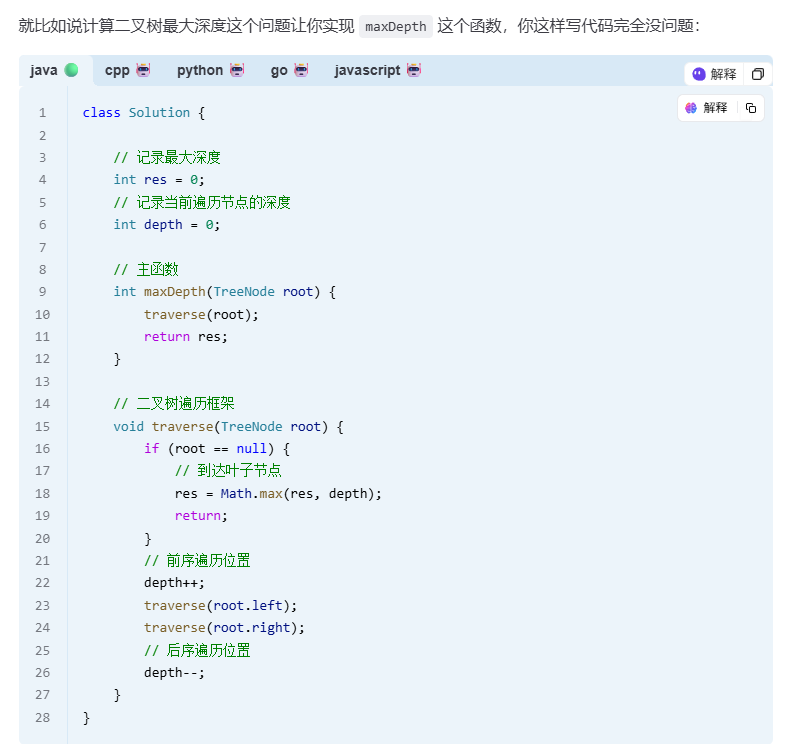
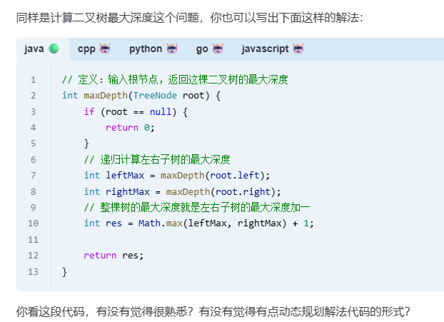
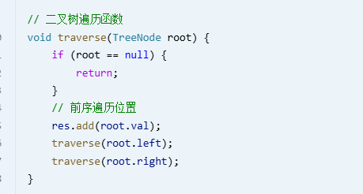

# 二叉树的遍历

DFS/回溯算法的本质就是递归遍历一棵穷举树（多叉树），而多叉树的递归遍历又是从二叉树的递归遍历衍生出来的。  
所以我说 DFS/回溯算法的本质是二叉树的递归遍历

# 分解问题的思维模式



# 思路拓展
二叉树的前序遍历  
  
同样可以通过分解问题转换为以下代码 
```
// 定义：输入一棵二叉树的根节点，返回这棵树的前序遍历结`
List<Integer> preorder(TreeNode root) {
    List<Integer> res = new LinkedList<>();
    if (root == null) {
        return res;
    }
    // 前序遍历的结果，root.val 在第一个
    res.add(root.val);
    // 后面接着左子树的前序遍历结果
    res.addAll(preorder(root.left));
    // 最后接着右子树的前序遍历结果
    res.addAll(preorder(root.right));  
    return res;
}
```

BFS 算法的本质就是遍历一幅图  
而图的遍历算法其实就是多叉树的遍历算法加了个 visited 数组防止死循环；  
多叉树的遍历算法又是从二叉树遍历算法衍生出来的。  
所以我说 BFS 算法的本质就是二叉树的层序遍历
```

```