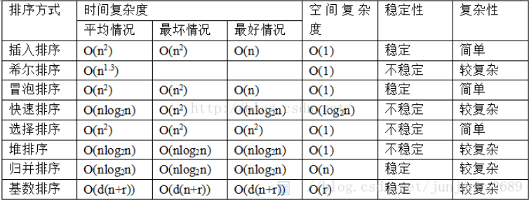

# 比较排序
在排序的最终结果中，各元素的次序依赖于他们之间的比较
## 交换思想
### 冒泡排序
通过重复比较相邻元素并交换位置，使较小的元素逐渐“浮”到数组的顶端。  
具体来说，冒泡排序通过多轮遍历，每一轮将未排序部分的最小元素移动到已排序部分的末尾，直到整个数组有序。
相同时不交换 -> 稳定排序
### 快速排序:
快速排序（Quick Sort）是一种基于分治策略的高效排序算法，  
其核心思想是通过选择一个基准元素（pivot），将数组划分为两个子数组，一部分元素小于基准，另一部分元素大于基准，
然后递归地对这两个子数组进行排序

可能会将后面相同的元素与基准元素交换 -> 不稳定排序
## 选择思想
每轮选择最小的 
### 选择排序
思想： 在未排序的中选择最小的， 然后交换
小于重复值的排在后面的重复值之后 -> 不稳定
### 堆排序:  不稳定
## 插入思想
每轮找到当前值得插入顺序
### 插入排序
插入排序是基于选择排序 的一种优化，将nums[sortedIndex] 插入(依次交换)到左侧的有序数组中。对于有序度较高的数组，插入排序的效率比较高。
碰见一个和插入元素相等的，那么插入元素把想插入的元素放在相等元素的后面-> 稳定
### 希尔排序
希尔排序（Shell Sort）是一种改进的插入排序算法，由 Donald Shell 于 1959 年提出。  
它通过将数组划分为若干个子序列，对每个子序列进行插入排序，逐步减小子序列的间隔，直到最后间隔为 1， 此时等同于普通的插入排序。  
希尔排序的效率通常优于直接插入排序，尤其适用于中等规模的数据集。

相同的元素可能在各自的插入排序中移动，最后其稳定性就会被打乱
## 归并排序
归并排序（Merge Sort）是一种基于分治策略的高效排序算法，其核心思想是将数组分割成两个子数组，分别进行排序，然后合并成一个有序数组。
该算法分为两个主要阶段：分解和合并。在分解阶段，数组被递归地分成两个子数组，直到每个子数组仅包含一个元素。在合并阶段，两个已排序的子数组被合并成一个有序数组。
如果两个当前元素相等时，我们把处在前面的序列的元素保存在结果序列的前面

# 非比较排序
## 计数排序: 
稳定排序
## 桶排序
## 基数排序: 
基于计数排序 -> 稳定

# 稳定性
首先，排序算法的稳定性大家应该都知道，通俗地讲就是能保证排序前2个相等的数其在序列的前后位置顺序和排序后它们两个的前后位置顺序相同。在简单形式化一下，如果Ai = Aj，Ai原来在位置前，排序后Ai还是要在Aj位置前。

其次，说一下稳定性的好处。排序算法如果是稳定的，那么从一个键上排序，然后再从另一个键上排序，第一个键排序的结果可以为第二个键排序所用。基数排序就是这样，先按低位排序，逐次按高位排序，低位相同的元素其顺序再高位也相同时是不会改变的。另外，如果排序算法稳定，对基于比较的排序算法而言，元素交换的次数可能会少一些（个人感觉，没有证实）。

一个班的学生已经按照学号大小排好序了，我现在要求按照年龄从小到大再排个序，如果年龄相同的，必须按照学号从小到大的顺序排列。
那么问题来了，你选择的年龄排序方法如果是不稳定的，是不是排序完了后年龄相同的一组学生学号就乱了，你就得把这组年龄相同的学生再按照学号拍一遍。
如果是稳定的排序算法，我就只需要按照年龄排一遍就好了  
https://blog.csdn.net/junjunba2689/article/details/81951417

# 选择
1. 若n较小(如n≤50)，可采用直接插入或直接选择排序。
   1. 当记录规模较小时，直接插入排序较好；
   2. 否则因为直接选择移动的记录数少于直接插人，应选直接选择排序为宜。
2. 若文件初始状态基本有序(指正序)，则应选用直接插入、冒泡或随机的快速排序为宜；
3. 若n较大，则应采用时间复杂度为O(nlgn)的排序方法：快速排序、堆排序或归并排序。
