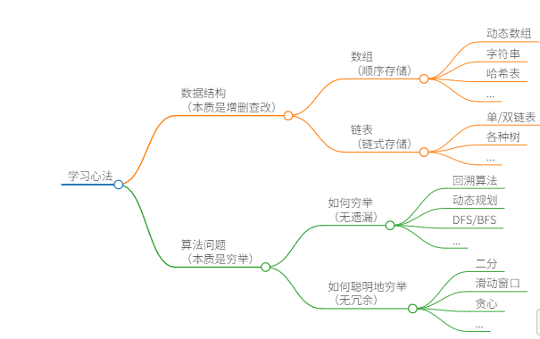

# 算法思维
计算机思维，需要你能够站在计算机的视角，抽象、化简实际问题，然后用合理的数据结构去解决问题

# 总结

种种数据结构，皆为数组（顺序存储）和链表（链式存储）的变换。
数据结构的关键点在于遍历和访问，即增删查改等基本操作。

种种算法，皆为穷举。
穷举的关键点在于无遗漏和无冗余。熟练掌握算法框架，可以做到无遗漏；充分利用信息，可以做到无冗余。

# 数据结构
数据结构的存储方式只有两种：  
数组（顺序存储）  
数组 由于是紧凑连续存储，可以随机访问，通过索引快速找到对应元素，而且相对节约存储空间。但正因为连续存储，内存空间必须一次性分配够，所以说数组如果要扩容，需要重新分配一块更大的空间，再把数据全部复制过去，时间复杂度 O(N)；而且你如果想在数组中间进行插入和删除，每次必须搬移后面的所有数据以保持连续，时间复杂度
O(N)。

链表（链式存储）
链表 因为元素不连续，而是靠指针指向下一个元素的位置，所以不存在数组的扩容问题；如果知道某一元素的前驱和后驱，操作指针即可删除该元素或者插入新元素，时间复杂度
O(1)。但是正因为存储空间不连续，你无法根据一个索引算出对应元素的地址，所以不能随机访问；而且由于每个元素必须存储指向前后元素位置的指针，会消耗相对更多的储存空间。

## 数据结构的基本操作
遍历+访问  
线性迭代 ： 数组遍历
递归：二叉树

# 算法的本质是穷举

## 如何穷举 -- 无遗漏
递归类问题， 比如回溯算法, 动态规划算法

## 如何聪明的穷举 -- 无冗余
其他非递归类问题